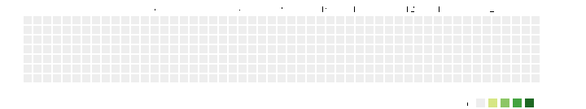

# pixela-marquee

Create a pixela graph animation like marquee.

### DEPENDENCIES

* Java

### USAGE

download latest files from [GitHub Release Page](https://github.com/ryosms/pixela-marquee/releases)
and run `bin/pixela-marquee(.bat)`
 
#### Options:

```text
 -e (--end-date) <yyyyMMdd>   : animation end date in 'yyyyMMdd' format.
 -g (--graph-id) <graph-id>   : graph id that will be converted
 -h (--help)                  : show help (default: true)
 -s (--start-date) <yyyyMMdd> : animation start date in 'yyyyMMdd' format.
 -u (--user-name) <username>  : username who owns the graph
```


### example

```bash
$ bin/pixela-marquee \
    -u ryosms \
    -g congratulations \
    -s 20170311 \
    -e 20191012
...
(snip)
Finish!
$ ls
...
pixela_yyyyMMdd.gif
```


